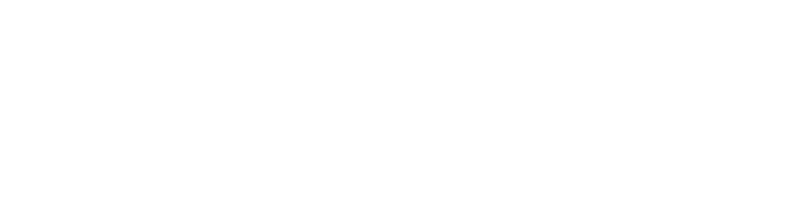

## Fyne Conf 2024

Fyne Conf 2024 will be our biggest ever event - to be held in Berlin, Germany and streamed online.

The event will take place on 20th September 2024 at the [Axica congress centre](https://www.axica.de/), in central Berlin.

This event is a chance to learn more about Fyne and how it can be used to
easily build robust and performant cross platform applications.
We will showcase useful techniques, best practices, new features and existing applications from around the community.
Novice to expert - coder, tester or designer - there is something for everyone.

[Book your Ticket](https://fyneconf2024.eventbrite.co.uk)

## Location

Fyne Conf 2024 will be held at the Axica congress centre in Berlin, Germany as well as online for virtual attendees.

The venue is situated adjacent to the Brandenburg Gate so there will be a chance for sight-seeing as well.
Plenty of accomodation and transport links are available nearby.

Access is strictly limited, so please [sign up now](https://fyneconf2024.eventbrite.co.uk) to book your space.

## Speakers

| Andy Williams | Renaldi Gondosubroto | Nicolás Palumbo |
|:---:|:---:|:---:|
| [andydotxyz](https://twitter.com/andydotxyz) | [renaldigondosubroto](https://www.linkedin.com/in/renaldigondosubroto/) | [npalumbo](https://www.linkedin.com/in/nicolás-palumbo-9372615/) |
|  |  |  |

|  | Simon Dassow |  |
|:---:|:---:|:---:|
|  | [simondassow](https://masto.ai/@simondassow) |  |
|  |  |  |

**More to be announced soon**

## Schedule - Friday 20 September 2024

The schedule went as follows, with afternoon talks being live streamed, but the social and networking is for in-person attendees only.
All items will be held in the Quadriga room of the Axica congress centre in central Berlin.

| Start (CEST) | Speaker | Title |
|:---:|:---|:---|
| 12:00 | | **Lunch and registration** (sandwiches and drinks provided) |
| 13:00 | Andy W | What's new in the Fyne Universe |
| 13:30 | Renaldi G | Dynamic Data Visualization with Fyne and Go: Creating Interactive Dashboards |
| 14:00 | Nicolás P | From the idea to the Google Play Store |
| 14:30 | | **Break** (refreshments provided) |
| 15:00 | Simon D | DoneThat with Fyne, DDD, EventSourcing, and CQRS |
| 15:30 | TBC | Community Showcase |
| 16:00 | Andy W | Building the Future & Fyne AMA |
| 16:30 | | **Social event** (drinks provided) |

Final details of the social events are still to be confirmed.

## Sponsorship

This event is sponsored by:

We would be happy to welcome more sponsors to this event, please get in touch!

## Support or Contact

Looking to find out more? The Fyne team can be contacted
in the ways described on our [main website](https://fyne.io/#contact).

## Archive

If you are interested in previous conferences and the session recordings, you can find them in this archive:

* [FyneConf 2023](/archive/2023) - Edinburgh
* [FyneConf 2022](/archive/2022) - Online
* [FyneConf 2021](/archive/2021) - Online
* [FyneConf 2020](/archive/2020) - Online
* [FyneConf 2019](/archive/2019) - Online

