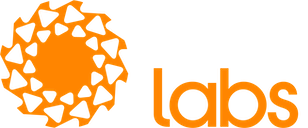

## Fyne Conf 2024

Fyne Conf 2024 was be our biggest ever event - held in Berlin, Germany and streamed online.

The event took place on 20th September 2024 at the [Axica congress centre](https://www.axica.de/), in central Berlin.

This event was a chance to learn more about Fyne and how it can be used to
easily build robust and performant cross platform applications.
We showcased useful techniques, best practices, new features and existing applications from around the community.
Novice to expert - coder, tester or designer - there was something for everyone.

## Location

Fyne Conf 2024 was held at the Axica congress centre in Berlin, Germany as well as online for virtual attendees.

The venue is situated adjacent to the Brandenburg Gate so there will be a chance for sight-seeing as well.
Plenty of accomodation and transport links are available nearby.

## Speakers

| Andy Williams | Renaldi Gondosubroto | Nicolás Palumbo |
|:---:|:---:|:---:|
| [andydotxyz](https://twitter.com/andydotxyz) | [renaldigondosubroto](https://www.linkedin.com/in/renaldigondosubroto/) | [npalumbo](https://www.linkedin.com/in/nicolás-palumbo-9372615/) |
|  |  |  |

| Simon Dassow | Samy Akroun | Michelle Williams |
|:---:|:---:|:---:|
| [simondassow](https://masto.ai/@simondassow) | [samy-akroun](https://www.linkedin.com/in/samy-akroun-4111bb19a/) | [imagingmedsci](https://twitter.com/imagingmedsci) |
|  |  |  |

| | Nick White | |
|:---:|:---:|:---:|
| | [njw](https://njw.name) | |
| |  | |

## Schedule - Friday 20 September 2024

The schedule went as follows, with afternoon talks were live streamed, with the social and networking being for in-person attendees only.
All items were held in the Quadriga room of the Axica congress centre in central Berlin.

| Start (CEST) | Speaker | Title |
|:---:|:---|:---|
| 12:00 | | **Lunch and registration** (sandwiches and drinks provided) |
| 13:00 | Andy W | What's new in the Fyne Universe - [Watch](https://youtu.be/nR9kMOdNOhM?si=YYdpRlkdDMNUHra-) |
| 13:30 | Renaldi G | Dynamic Data Visualization with Fyne and Go: Creating Interactive Dashboards - [Watch](https://youtu.be/KOVMhI0ePGs?si=8z5NxkXMZILwIVwe) |
| 14:00 | Nicolás P | From the idea to the Google Play Store - [Watch](https://youtu.be/nDnAfILODkg?si=cRfhCoM4MSf76-h1) |
| 14:30 | | **Break** (refreshments provided) |
| 15:00 | Simon D | DoneThat with Fyne, DDD, EventSourcing, and CQRS - [Watch](https://youtu.be/cuUspGoKJtg?si=P1-ELoEo8DoTYVY8) |
| 15:30 | Samy A, Michelle W & Nick W | Lightning talks & Community Showcase - [Watch](https://youtu.be/RIZZV-3bTgw?si=tKYT9-4hBBlaSv1E) |
| 16:00 | Andy W | Building the Future & Fyne AMA - [Watch](https://youtu.be/-ynhV07HR1E?si=vMUegb2wF-Q7mHox) |
| 16:30 | | **Social event** (drinks provided) |

We also had a great trip out for dinner and more discussion when the venue closed!

### Contributor planning

Before the main event we used the space to have a discussion with project 
contributors and others who would like to help the future of Fyne.

The discussion covered technical topics, community management and how to get started as a contributor.

| Start (CEST) | Title |
|:---:|:---|:---|
| 9:00 | **Breakfast and arrival** (Pastries and drinks provided) |
| 9:30 | Project discussions, contributor planning and coding session |

## Sponsorship

This event was sponsored by:

Media Partners:

## Support or Contact

Looking to find out more? The Fyne team can be contacted
in the ways described on our [main website](https://fyne.io/#contact).

## Archive

If you are interested in previous conferences and the session recordings, you can find them in this archive:

* [FyneConf 2023](/archive/2023) - Edinburgh
* [FyneConf 2022](/archive/2022) - Online
* [FyneConf 2021](/archive/2021) - Online
* [FyneConf 2020](/archive/2020) - Online
* [FyneConf 2019](/archive/2019) - Online

